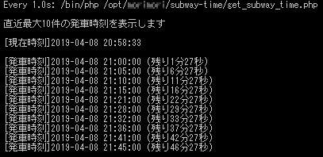

# subway-time
コンソールでスクリプトを実行すると直近N件の発車時刻と発車時刻までの時間を表示してくれるだけのツール。  
駅のホームで無駄に電車を待つのが嫌なので作成。



## 設定手順
list.php に時刻を定義 (list.php.sample をコピーすると良いです)  
0時以降は24時、25時といった表記で。
```
<?php
return [
    '05:15',
    '05:27',
    '05:38',
    ︙
    // 0時以降は24時、25時表記で
    '24:06',
    '24:20',
];
```

## 実行
```
// デフォルト(引数無し)では直近最大10件表示
php get_time_subway.php

// 直近最大8件表示
php get_time_subway.php 8
```

## alias設定
`~/.bashrc` に alias を追加しておくと楽です。  
### 設定例
```
# 例
alias yushima='/bin/php /home/●●/my_script/subway-time/get_time_subway.php'
```

### 読み込み
```
source ~/.bashrc
```

### 実行
```
// デフォルト(引数無し)では直近最大10件表示
yushima

// 直近最大8件表示
yushima 8
```
